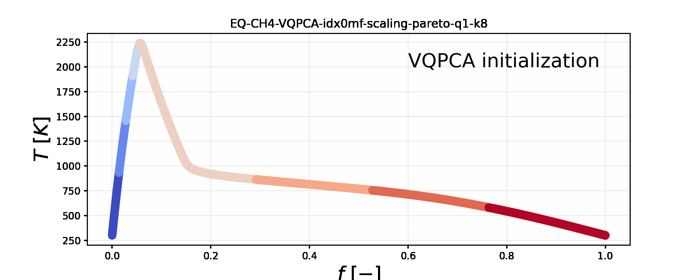

# Animations of cluster re-distribution inside VQPCA

The animations below show how cluster definitions change iteratively during VQPCA. 

## Chemical equilibrium (EQ) dataset

### Auto scaling on a dataset $\mathbf{X} = [T, Y_i]$

#### Initialization with $f$-bins

The observations in clusters get re-distributed in an iterative process from the initial bins of the mixture fraction ($f$) vector:

#### Random initialization

The observations in clusters get re-distributed in an iterative process from the initial randomly generated clusters:

#### Uniform initialization

The observations in clusters get re-distributed in an iterative process from the initial uniformly generated clusters:

### Pareto scaling on a dataset $\mathbf{X} = [Y_i]$

#### Initialization with $f$-bins

The observations in clusters get re-distributed in an iterative process from the initial bins of the mixture fraction ($f$) vector:

#### Random initialization

The observations in clusters get re-distributed in an iterative process from the initial randomly generated clusters:

#### Uniform initialization

The observations in clusters get re-distributed in an iterative process from the initial uniformly generated clusters:

## Direct numerical simulation (DNS) dataset
